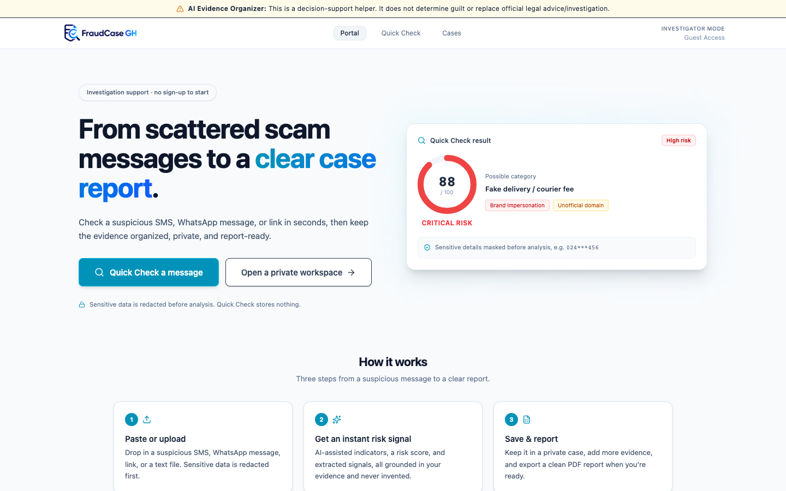

<div align="center">
  
</div>

# FraudCase GH

> A privacy-first web app that helps people in Ghana organize digital-scam evidence, understand the risk, and produce a clean, non-accusatory incident report, without doxxing, shaming, or declaring anyone guilty.

FraudCase GH turns a confusing pile of suspicious SMS, WhatsApp messages, links, and Mobile Money receipts into a structured case file with an AI-assisted risk assessment, extracted evidence entities, a timeline, an evidence checklist, and a downloadable PDF report suitable for sharing with a bank, mobile-money operator, or the National Cyber Security Authority.

> **Note on positioning:** FraudCase GH is a **production-grade fraud evidence and investigation platform** for Ghana — a decision-support and evidence-organization tool, **not** a law-enforcement system and **not** a verdict on any person. Operational requirements live in [`docs/PRODUCTION_PLAN.md`](docs/PRODUCTION_PLAN.md).

<div align="center">
  
</div>

---

## Table of contents
- [Problem statement](#problem-statement)
- [Key features](#key-features)
- [Tech stack](#tech-stack)
- [Architecture summary](#architecture-summary)
- [Security & privacy model](#security--privacy-model)
- [AI safety & non-accusatory positioning](#ai-safety--non-accusatory-positioning)
- [Local setup](#local-setup)
- [Environment variables](#environment-variables)
- [Screenshots](#screenshots)
- [Demo workflow](#demo-workflow)
- [Known limitations](#known-limitations)
- [Roadmap](#roadmap)
- [Further documentation](#further-documentation)

---

## Problem statement

Digital fraud is widespread in Ghana: fake delivery/clearance-fee smishing (e.g. spoofed `GH-POST` senders), Mobile Money "wrong transfer / reversal" tricks, WhatsApp task-and-deposit recruitment scams, and credential-phishing links. When someone is targeted, they typically face three problems:

1. **Disorganized evidence.** Screenshots, texts, links, and receipts are scattered and easy to lose before they can be reported.
2. **Uncertainty about risk.** It is hard to tell how dangerous a message is, or what to do next.
3. **Risk of overreaction.** Public "name and shame" responses can defame innocent people and expose the victim's own sensitive data.

FraudCase GH addresses all three: it **organizes** evidence into a private case, **assesses** risk with cautious AI assistance, and **frames** everything as non-accusatory decision support, while **redacting** sensitive data before any of it reaches an AI model.

---

## Key features

- **Quick Check (public, no sign-up).** Paste a suspicious message or link and get an instant, ephemeral risk read-out. Input is **redacted before analysis** and **nothing is stored**.
- **Private case workspace (authenticated).** Create cases, add text evidence, upload files, run analysis, and keep everything isolated to your own account.
- **AI-assisted analysis.** Risk score and category, possible fraud indicators, extracted entities (URLs, amounts, phone/sender IDs), a timeline, an evidence checklist, and recommended next steps — grounded in the evidence you provide.
- **Heuristic fallback.** If no AI key is configured (or the model errors), a deterministic, **non-fabricating** heuristic produces a safe, structured result so the app still works offline-first.
- **Consent-gated community signals.** Optionally contribute a **redacted** signal to help spot recurring scam patterns. No raw input and no files are ever shared.
- **Admin review.** An allowlisted admin can review community signals for pattern analysis. Fail-closed: if no admins are configured, the dashboard is inaccessible to everyone.
- **Downloadable PDF report.** Export a clean, dossier-style PDF generated client-side.

---

## Tech stack

| Layer | Technology |
|---|---|
| Frontend | React 19, TypeScript, Vite 6, Tailwind CSS 4, `motion` (animations), `lucide-react` (icons) |
| PDF / sanitization | `jsPDF`, `html2canvas`, `DOMPurify` (client-side report export) |
| Backend | Node.js, Express 4, `tsx` (dev), `esbuild` (production bundle), `multer` (uploads) |
| Auth / Data / Files | Firebase Authentication (email/password), Cloud Firestore, Firebase Cloud Storage |
| Server credentials | Firebase Admin SDK via **Application Default Credentials (ADC)** |
| AI | Google Gemini via `@google/genai` (model `gemini-3.5-flash`) + deterministic heuristic fallback |
| Tests | Node built-in test runner (`node:test`) executed through `tsx` |

---

## Architecture summary

FraudCase GH is a **single full-stack service**: one Express server (`server.ts`) hosts the JSON API under `/api/*` and serves the React client (via Vite middleware in development, and the static `dist/` build plus a bundled `dist/server.cjs` in production). It listens on port `3000`.

```
Browser (React/Vite SPA)
        │  Authorization: Bearer <Firebase ID token>
        ▼
Express server (server.ts)  ──►  Firebase Admin SDK (ADC)
  • /api/* routes                   ├─ Firebase Auth  (verifyIdToken)
  • auth middleware                 ├─ Cloud Firestore (cases, signals)
  • redaction + file validation     └─ Cloud Storage  (evidence files)
  • Gemini analysis (+ fallback) ──►  Google Gemini (@google/genai)
```

Three primary flows — **Quick Check** (public, ephemeral), **Private case** (authenticated, owner-isolated), and **Community signal + admin review** (public redacted submit, admin-only read) — plus a **client-side PDF export**. See [`docs/ARCHITECTURE_OVERVIEW.md`](docs/ARCHITECTURE_OVERVIEW.md) for the detailed component and request-flow breakdown.

---

## Security & privacy model

- **Token-verified API.** Protected endpoints require `Authorization: Bearer <Firebase ID token>`, verified server-side with `adminAuth.verifyIdToken`.
- **Owner isolation (`ownerId`).** Cases are queried with `where("ownerId", "==", uid)`, and every case-scoped endpoint re-checks ownership before returning or mutating data. `ownerId` is taken only from the verified token — never from client input — and the update handler whitelists editable fields so ownership cannot be reassigned.
- **Redaction before AI.** `redactPIIAndSecrets` masks Ghana Card numbers, emails, phone numbers, card/bank numbers, API keys/tokens, and PIN/OTP codes before any text is sent to a model.
- **Ephemeral Quick Check.** Public Quick Check results are computed and returned without being written to Firestore, Storage, or disk.
- **Redacted-only community signals.** Shared signals contain only redacted/derived data — no raw input and no files.
- **Fail-closed admin.** Admin review requires an allowlisted email (`ADMIN_EMAILS`); if unset, no one is an admin.
- **No public scammer directory.** There is no public listing of people, cases, or signals.

Full detail (with code references) is in [`docs/SECURITY_PRIVACY_OVERVIEW.md`](docs/SECURITY_PRIVACY_OVERVIEW.md).

---

## AI safety & non-accusatory positioning

FraudCase GH is deliberately designed to **avoid causing harm**:

- **No guilt declarations.** The system instruction and prompt forbid framing anyone as a confirmed criminal; outputs use cautious language ("possible indicators", "risk signals"). Every analysis carries a disclaimer that it is not legal advice or a law-enforcement determination.
- **Evidence grounding.** Extracted entities must come from the supplied evidence only; when a value is absent the field stays empty rather than being invented. The heuristic fallback follows the same rule and does **not** fabricate names, domains, phone numbers, or amounts.
- **Risk as decision support.** The risk score guides next steps; it is not a verdict, and the UI/report keep that framing.
- **No vigilante tooling.** No doxxing, public shaming, or open "scammer lists" are supported.

---

## Local setup

**Prerequisites:** Node.js (18+), a Firebase project (Auth + Firestore + Storage), and either the `gcloud` CLI (for ADC) or a service-account JSON. Optionally a Google Gemini API key.

```bash
# 1. Install dependencies
npm install

# 2. Configure environment
cp .env.example .env          # then fill in values (see table below)

# 3. Provide server credentials (Firebase Admin SDK)
#    Preferred: Application Default Credentials via gcloud
gcloud auth application-default login
gcloud config set project <your-firebase-project-id>
#    (Alternative: set GOOGLE_APPLICATION_CREDENTIALS to a service-account JSON path)

# 4. In the Firebase console, enable the Email/Password sign-in provider

# 5. Sanity-check which variables/credentials are detected (never prints values)
npm run check:env

# 6. Run
npm run dev                   # http://localhost:3000
```

**Scripts:**

| Command | Purpose |
|---|---|
| `npm run dev` | Start the full-stack dev server (API + Vite) |
| `npm run build` | Build the client and bundle the server to `dist/` |
| `npm start` | Run the production bundle (`dist/server.cjs`) |
| `npm run lint` | Type-check the project (`tsc --noEmit`) |
| `npm test` | Run analysis-quality tests (`node:test` via `tsx`) |
| `npm run check:env` | Report which env vars / credentials are present (no values printed) |

---

## Environment variables

No secret values are shown here. See `.env.example` for the template. Real values belong only in your local, git-ignored `.env`.

| Variable | Scope | Required? | Notes |
|---|---|---|---|
| `VITE_FIREBASE_API_KEY` | Client (build-time) | Yes | Firebase **web** config — public by design (ships in the browser bundle) |
| `VITE_FIREBASE_AUTH_DOMAIN` | Client | Yes | Public Firebase web config |
| `VITE_FIREBASE_PROJECT_ID` | Client | Yes | Public Firebase web config |
| `VITE_FIREBASE_STORAGE_BUCKET` | Client | Yes | Public Firebase web config |
| `VITE_FIREBASE_MESSAGING_SENDER_ID` | Client | Yes | Public Firebase web config |
| `VITE_FIREBASE_APP_ID` | Client | Yes | Public Firebase web config |
| `VITE_FIREBASE_FIRESTORE_DATABASE_ID` | Client | Yes | Custom Firestore database id |
| `GEMINI_API_KEY` | Server | Optional | If unset/invalid, analysis uses the heuristic fallback |
| `ADMIN_EMAILS` | Server | Optional | Comma-separated allowlist for the admin dashboard; **fail-closed** if empty |
| `GOOGLE_APPLICATION_CREDENTIALS` | Server | Optional | Path to a service-account JSON; **not needed if using ADC** |
| `APP_URL` | Server | Optional | Self-referential base URL (injected at runtime in hosted environments) |

> The Firebase **web** keys are not secrets — they identify the project and are protected by Firebase Security Rules / App Check, not by being hidden. The server-side values (`GEMINI_API_KEY`, service-account credentials) **are** secrets and must never be committed.

---

## Screenshots

### Landing page


_More views (Quick Check result, case detail, analysis, PDF report, admin signals) live in `docs/screenshots/` and can be added here._

---

## Demo workflow

1. **Public Quick Check** — paste a suspicious delivery-fee SMS; see the redacted analysis instantly (nothing stored).
2. **Share a redacted signal** (optional, consent-gated) — contribute the redacted pattern for review.
3. **Sign up / sign in** — create a workspace with email/password.
4. **Create a private case** — title, description, incident date.
5. **Add evidence** — paste the SMS/WhatsApp/email text.
6. **Upload a file** — attach a screenshot or receipt (stored per-user in Cloud Storage).
7. **Run analysis** — Gemini (or the heuristic fallback) produces the structured assessment.
8. **Review the report** — risk, indicators, entities, timeline, checklist, next steps.
9. **Download the PDF** — export the dossier.
10. **Admin signal review** — (as an allowlisted admin) review submitted community signals.

A manual end-to-end QA checklist lives in [`docs/MANUAL_E2E_QA.md`](docs/MANUAL_E2E_QA.md).

---

## Known limitations

- **Heuristic fallback is coarse.** Without Gemini, categorization is keyword-based; it is intentionally conservative and never fabricates entities, but it is less nuanced than the model.
- **Per-indicator severity is heuristic.** Indicator badges are derived from text keywords; the **overall risk score** is the authoritative signal.
- **Local-dev storage fallback.** In environments without Cloud Storage credentials, uploads fall back to a clearly-marked local directory (`provider=local-dev`) — intended for development only.
- **Security rules in repo.** `firestore.rules` is checked in; Storage rules are documented in [`docs/STORAGE_RULES.md`](docs/STORAGE_RULES.md). Deploy both for defense-in-depth alongside server-side checks.
- **Automated coverage is growing.** CI runs lint, test, and build; owner-isolation and analysis-quality tests are in place. Full E2E is on the production roadmap ([`docs/PRODUCTION_DEFINITION_OF_DONE.md`](docs/PRODUCTION_DEFINITION_OF_DONE.md)).
- **Production hardening in progress.** App Check, shared rate limiting, WAF, and multimodal evidence extraction are sequenced in [`docs/PRODUCTION_PLAN.md`](docs/PRODUCTION_PLAN.md).

---

## Roadmap

See [`docs/PRODUCTION_PLAN.md`](docs/PRODUCTION_PLAN.md) for the full phased roadmap. Highlights:

- **Sprint 1 (current):** CI/security gates, production docs, owner-isolation regression tests
- **Sprint 2:** App Check, shared rate limiter, WAF guidance, audit logging
- **Sprint 3–4:** Private multimodal screenshot/PDF extraction with consent, redaction, and verification UI
- **Sprint 5–6:** Report maturity, admin audit, E2E/abuse tests, public launch checklist

Additional product goals:

- Signed URLs for time-limited evidence-file access
- More robust, multi-language entity extraction (e.g. Twi/Pidgin phrasing)
- Case collaboration / scoped sharing with banks or responders
- Optional reporting integrations (e.g. NCA shortcode 292) — currently guidance only

---

## Further documentation

### Production (source of truth)

- [`docs/PRODUCTION_PLAN.md`](docs/PRODUCTION_PLAN.md) — architecture, threat model, roadmap
- [`docs/AGENT_PLAYBOOK.md`](docs/AGENT_PLAYBOOK.md) — agent operating rules
- [`docs/PRODUCTION_DEFINITION_OF_DONE.md`](docs/PRODUCTION_DEFINITION_OF_DONE.md) — launch criteria
- [`docs/PRODUCTION_ENV_CHECKLIST.md`](docs/PRODUCTION_ENV_CHECKLIST.md) — deploy checklist
- [`docs/research/README.md`](docs/research/README.md) — advisory research imports

### Architecture & security

- [`docs/PORTFOLIO_CASE_STUDY.md`](docs/PORTFOLIO_CASE_STUDY.md) — product story and design decisions
- [`docs/ARCHITECTURE_OVERVIEW.md`](docs/ARCHITECTURE_OVERVIEW.md) — components and request flows
- [`docs/SECURITY_PRIVACY_OVERVIEW.md`](docs/SECURITY_PRIVACY_OVERVIEW.md) — security & privacy model
- [`docs/ENV_SETUP.md`](docs/ENV_SETUP.md) — environment & credentials setup

---

_FraudCase GH does not provide legal advice and is not affiliated with any government agency or law-enforcement authority. Roadmap informed by external research notes, including Google AI Studio; final design, validation, and implementation are maintained in-repo._
